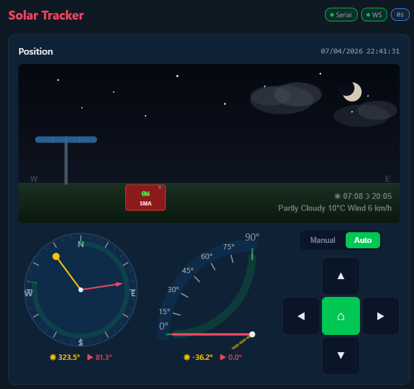

# Solar Tracker API

REST API, MQTT bridge, and web UI for controlling Metalogalva solar tracking systems. Replaces the Windows STcontrol application with a Raspberry Pi-based solution.

  

## Quick Start

```bash
git clone https://github.com/luis15pt/metalogalva-solartracker-api.git
cd metalogalva-solartracker-api
docker compose up -d
```

Open `http://<pi-ip>:8000` in your browser.

> Pre-built arm64 images are pulled from GHCR automatically. No local build needed.

## Hardware Setup

You need a **USB-to-RS232 serial adapter** connected between the Raspberry Pi and the solar tracker's COM port.

**Tested adapters**: FTDI FT232 (recommended), CH340, CP2102

**Wiring**: Adapter TX → Tracker RX, Adapter RX → Tracker TX, GND → GND. The protocol uses RS-485 half-duplex at 9600 baud with RTS toggling.

**Verify on Linux**:
```bash
# Check the adapter is detected
lsusb | grep -iE 'ftdi|ch340|cp210|serial'

# Check the device node
ls /dev/ttyUSB*

# Check permissions (need dialout group)
stat -c '%G %a' /dev/ttyUSB0
# Should show: dialout 660

# Add your user to dialout if needed
sudo usermod -aG dialout $USER
```

The Pi Zero 2W only has one USB data port (the inner one). If you need both WiFi and serial, use a USB-OTG hub or a female-to-female USB adapter as a passthrough.

## Screenshots

<details open>
<summary>Night Mode</summary>



</details>

<details>
<summary>Day Mode</summary>

*Screenshot coming soon*

</details>

## Features

- **Web UI** — Mobile-first dashboard with animated sky scene (sun/moon, weather, rain/clouds), compass and altitude gauges, d-pad controls
- **SMA Inverter** — Live energy production data from SBFspot database
- **MQTT** — Home Assistant auto-discovery with Mosquitto bridge support
- **Real-time** — WebSocket live updates from the tracker
- **Logging** — Persistent state change logs (alarms, mode, position transitions)

## Web UI

The dashboard shows a live animated scene with the tracker and SMA inverter. The sky changes with time of day (sunrise/sunset gradients, stars, moon at night) and weather conditions (clouds, rain from Open-Meteo API).

Below the scene: compass gauge (E/S/W), altitude gauge (0-90°), and directional controls with HOME button.

<details>
<summary>Configuration</summary>

Environment variables (set in `docker-compose.yml`):

| Variable | Default | Description |
|----------|---------|-------------|
| `SERIAL_PORT` | `/dev/ttyUSB0` | Serial port device |
| `SERIAL_BAUDRATE` | `9600` | Baud rate |
| `MQTT_BROKER` | `mosquitto` | MQTT broker host |
| `MQTT_PORT` | `1883` | MQTT broker port |
| `MQTT_TOPIC_PREFIX` | `solartracker` | MQTT topic prefix |
| `SBFSPOT_DB` | `/data/SBFspot.db` | SBFspot SQLite database path |
| `LOG_LEVEL` | `INFO` | Logging level |

Docker volumes:
- `./data:/app/data` — Persistent logs and observed limits
- `SBFspot.db:/data/SBFspot.db:ro` — SMA inverter database (read-only)

The `group_add` in docker-compose must match your system's dialout GID for serial port access. Check with `stat -c '%g' /dev/ttyUSB0` (typically `20` on Raspberry Pi OS).

</details>

<details>
<summary>API Endpoints</summary>

**Connection**
| Method | Endpoint | Description |
|--------|----------|-------------|
| GET | `/serial/ports` | List serial ports |
| POST | `/serial/connect` | Connect to serial port |
| POST | `/serial/disconnect` | Disconnect |

**Tracker Control**
| Method | Endpoint | Description |
|--------|----------|-------------|
| GET | `/tracker/status` | Full tracker status |
| POST | `/tracker/move/{direction}/start` | Start movement |
| POST | `/tracker/move/{direction}/stop` | Stop movement |
| POST | `/tracker/mode/{mode}` | Set manual/automatic |
| POST | `/tracker/home` | Go to HOME position |
| POST | `/tracker/stow` | Go to STOW position |
| POST | `/tracker/alarms/clear` | Clear active alarms |
| POST | `/tracker/alarms/clear-history` | Clear alarm history |
| POST | `/tracker/datetime/sync` | Sync tracker clock to UTC |
| POST | `/tracker/gps` | Set GPS location |

**Inverter**
| Method | Endpoint | Description |
|--------|----------|-------------|
| GET | `/inverter/status` | Current power, yield, temperature |
| GET | `/inverter/today` | Today's power readings for charting |

**WebSocket**: `/ws` — Real-time status updates (JSON)

</details>

<details>
<summary>MQTT Topics</summary>

**State** (published by API):
`solartracker/availability`, `solartracker/state/mode`, `solartracker/state/connected`, `solartracker/state/position/horizontal`, `solartracker/state/position/vertical`, `solartracker/state/alarms`

**Commands** (subscribed by API):
`solartracker/command/move`, `solartracker/command/mode`, `solartracker/command/clear_alarms`, `solartracker/command/go_home`, `solartracker/command/go_stow`, `solartracker/command/sync_datetime`

</details>

## Home Assistant

The API publishes MQTT auto-discovery messages — entities appear automatically in HA.

If you already have an MQTT broker, configure a bridge in `mosquitto/config/mosquitto.conf` instead of adding a second broker to HA.

## Protocol

Reverse engineered from STcontrol V4.0.4.0, COM port captures, and HCS12 firmware disassembly. See [docs/protocol.md](docs/protocol.md) for full documentation.

<details>
<summary>Key protocol notes</summary>

- RS-485 half-duplex, 9600 baud, RTS toggling
- Mode byte 7: `0x00` = AUTO, `0x01` = MANUAL
- Panel vertical: `90` = flat/stowed, `0` = vertical
- Alarm byte at offset **37** (not 36)
- Alarm bit 3 = tilt limit (stow), not wind speed
- Corrupt packets (alarm >= `0xF0`) are filtered

</details>

## Development

```bash
python -m venv venv && source venv/bin/activate
pip install -r requirements.txt
uvicorn src.solartracker.main:app --reload --host 0.0.0.0 --port 8000
```

## License

MIT — see [LICENSE](LICENSE).
